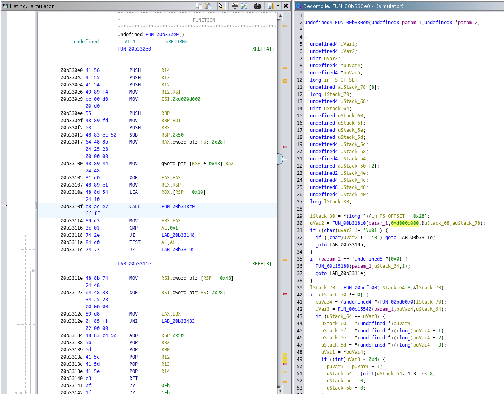

# Security analysis of Garmin watch software
## Connect IQ - third party apps

### Connect IQ SDK
Garmin created SDK for third party app development. It is integrated with Visual Studio Code through the Monkey C extension. There is an official documentation describing the development process with Visual Studio Code. However, it doesn't describe the specific scripts and tools contained in the SDK that are used by the extension.
The SDK consists mostly of Java class used for compiling and packaging the application. Additionally, a simulator is provided for testing the apps. Unfortunately, it is implemented as a binary ELF file, which makes the reverse engineering more difficult.
Moreover, other scripts are provided for other tasks such as uploading an app to the simulator. 

List of tools:
- _monkeybrains.jar_ - compiles and build the project
- _simulator_ - simulates a chosen Garmin device
- _monkeydo_ - executes Connect IQ executable on the simulator 

Other scripts: _barrelbuild, barreltest, connectiq, era, mdd, monkeyc, monkeygraph, monkeydoc, shell, monkeymotion_

### App signature
The generated app bytecode has to be signed by the developer.
The signing algorithm uses SHA1 hash of the bytecode that is signed with a private RSA key.
The key is 4096 long, which is more than recommended.

For the signing, conventions described in PKCS #1 v2.2 are used.

SHA-1 is no longer considered secure against well-funded opponents. NIST formally deprecated use of this hash function in 2011. In 2020 there was a paper published demonstrating a chosen-prefix collision attack. It still doesn't offer a viable solution to find a collision to a given hash for a chosen prefix. However, the function has been already broken and in the upcoming years new attacks might be discovered. 

#### Algorithm for signing:
- read bytes from PRG file that hasn't been signed yet
- don't include the bytes at the end of the file (called TERMINATOR in the code)
- compute the signature with Java security signature library (SHA1withRSA)
- Append the file bytes Developer signature, consisting of:
  - magic number
  - length of the whole signature
  - signature
  - modulus
  - exponent
- Or in the case of the store signature:
  - a different magic number
  - length of the whole signature
  - signature
- Append the terminating bytes that were skipped before

### Compiler
The compiler is written in Java, which makes the analysis of the code relatively simple. Nonetheless, the compilation is a complicated process consisting of several stages.  
Java class `Opcode` contains a list of instructions in the final bytecode. Additionally, SDK provides a mapping of all API methods to the number values, which is probably some type of address.

During the compilation, the code is translated to mid-level intermediate representation (MIR). The files containing the representations are created during the build process and can be used for better understanding of the final artifact.

### Modifying the executable
In order to test the security of the virtual machine, it is useful to be able to edit the executable. However, after changing the bytecode, it is necessary to sign the executable again. After analysis of _monkeybrains.jar_ file, I created a kotlin script that signs the app again.

## Virtual Machine

### Simulator decompilation with Ghidra

Searching for value `0xD000D000` reveals two references in the code. Based on the [article](https://www.atredis.com/blog/2020/11/4/garmin-forerunner-235-dion-blazakis) it is a PRG header tag. The code doesn't look similar to the one included in the article. Theoretically, I could try to analyze the logic for parsing the PRG file. However, it doesn't seem like something that can be done in a reasonable amount of time.

## ConnectIQ store

### Analysis from the users' perspective
Application allows the users to download third party apps to the watch.
The user can select an app to install it. 
Notes:
- the watch is not required to be connected to the internet
- if the watch is not connected to the phone, the store shows that the installation is queued.

Based on that, it seems that:
- the phone downloads the app
- sends it to the watch via BT

### Decompilation of the app

I decompiled the app with JADX. The app is obfuscated.   

I couldn't find any code that would be responsible for checking the certificate of the downloaded app. I was looking for keywords such as the library that was used during a build process, SHA1, RSA.

Probably there is not much of a point to check the certificate on the phone, assuming that the watch is doing it.

I didn't manage to find the code responsible for downloading the app.

### Trying men-in-the-middle attack
- emulator does not have access to BT
- linux hotspot + mitmproxy - problem with certificates. Two options to solve the problem:
  - Rooted phone
  - Modify the app

### Trying to modify the app
The minimum supported Android version is 7. Those versions require root access to add certificates supported by applications. Another option is to modify the app to accept user added certificates.

#### Attempt 1 - Android Unpinner
Use Android Unpinner - https://github.com/mitmproxy/android-unpinner

The app starts when connected to mitmproxy. However, when trying to log in, it goes back to the welcome screen. 
**Not possible to log in**.

#### Attempt 2 — manually modify the apk and sign again
Using Apktool(https://apktool.org/) to unpack the app, modify, and pack again, align zip file and sign with a debug key.

After installing the app, there are some errors with missing resources. I did not investigate it further.

#### Attempt 3 - just resign the app
Just resigning the app with a debug key. The app starts, but when trying to log in it seems to work the same as the app from the attempt #1.

### Analyzing mitmproxy traffic
Based on the limited amount of traffic that went through mitmproxy:

Used domains:
- `sso.garmin.com` - Qualys SSl Labs analysis: **grade B**
  - server supports **TLS 1.1**
- `diauth.garmin.com` - Qualys SSl Labs analysis: **grade A**

## TODO

### Thoughts
- Does the watch check the signature of installed app? (probably yes...) 
  - (I can only test it as a black box, without access to the firmware.)
  - Does it have to be signed by the store? 
  - Is the store signature applied on a plain PRG file, or the one already signed by the developer?
    - Compared to Android: there is no store signature, developer signature is used to make sure that the app can be updated only by the original developer of the app.
  - What if the key leaks?
  - Is it possible to install the developer signed app with the same BT API that the store uses?
    - If yes, what about MITM attack?

### Connect IQ apps TODO
- analyze native calls security
- analyze Monkey C security such as:
  - bound checking
  - overflows
  - pointers/references,
  - memory management

Things to analyze:
- simulator
- ConnectIQ store
  - decompile
  - sniff
    - How? connect the phone
    - simulator? not going to work?

## Additional resources
VM analysis:
- https://github.com/pzl/ciqdb
- https://www.atredis.com/blog/2020/11/4/garmin-forerunner-235-dion-blazakis

Android app analysis:
- [Apps no longer trust user added certificates](https://android-developers.googleblog.com/2016/07/changes-to-trusted-certificate.html)
- [Android - network security configuration](https://developer.android.com/training/articles/security-config#TrustingDebugCa)

